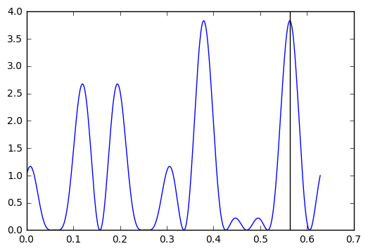

```python
import numpy as np
from scipy.sparse import dia_matrix # Sparse diagonal matrix, see below
from numpy.linalg import inv # Inverse function
from math import pi, inf # Some mathematical "numbers".
```

The function

$$f(x) = [cos(50x) + sin(20x)]^2$$

has to be maximized. Notice that $f(x)$ has period $\frac{\pi}{5}$ and it is bounded above since $sin(20x) \le 1$ and $cos(50x) \le 1$, implying that $f(x) \le 4$. Therefore there is an infinite number of global maxima.


```python
def f(x):
    return((np.cos(50*x) + np.sin(20*x))**2)
```

We restrict our attention to the interval $[0,\frac{\pi}{5})$. In the picture below, we represented the function in the interval $[0,\frac{2\pi}{5})$, to show graphically the periodicity of $f(x)$.


```python
import matplotlib.pyplot as plt

lspace = np.linspace(0,2*pi/5,1000)

plt.plot(lspace,f(lspace))
plt.axvline(x=pi/5,color="k")
plt.show()
```


As the figure suggests, perhaps there are two global maxima even within the interval $[0, \frac{\pi}{5})$. The proposal distribution for the simulated annealing is defined as

$$0 \le a_t < b_t \le 1, \qquad U_t \sim \text{Uniform}(a_t,b_t)$$

where

$$a_t = \max{(0, x_t - \epsilon)}, \qquad b_t = \min{\left(\frac{\pi}{5},x_t + \epsilon\right)}.$$

It is crucial to initialize $x_0 \in [0, \frac{\pi}{5}]$, otherwise one could obtain $a_t \ge b_t$. We set $\epsilon = 0.5$ and $\tau_t = \frac{1}{\log{(t+2)}}$.

We fixed $T = 1000$ iterations as stopping rules and we initialized $x_0 = 0$. Then, we keep as maximum value the maximum among the proposed values $u_1,\dots,u_T$. Indeed, it is not convenient to keep the last value as results if the whole sequence of values is already available.


```python
T = 1000
epsilon = 0.5   
x = 0       
x_maximum =  x
fxm = f(x_maximum)

for t in range(T):
    a = max(0,x - epsilon)
    b = min(pi/5,x + epsilon)
    tau = 1/np.log(t+2)
    x_star  = np.random.uniform(a,b)
    fx,fxstar = f(x),f(x_star)
    Delta     = fxstar - fx
    alpha     = np.exp(Delta/tau)
    u         = np.random.uniform()
    if u < alpha:
        x = x_star
    if fxm < fxstar:
        x_maximum = x_star
        fxm = f(x_maximum)
    #print([x,f(x),tau])
```

After few trials, one can see that, in this case, the choice of the starting point $x_0$ does not affect the final result: the algorithm does not stuck in a local maxima. However, since there are two global maxima in the interval, the algorithm randomly identify one of them. The identified maximum for one run is displayed below.


```python
import matplotlib.pyplot as plt

lspace = np.linspace(0,pi/5,1000)

plt.plot(lspace,f(lspace))
plt.axvline(x=x_maximum,color="k")
plt.show()
```





# Logistic regression

We first define the inverse logit function, that is

$$logit^{-1}(x) = \frac{1}{1+\exp{(-x)}},$$

which will be useful later.


```python
def invlogit(x):
    return(1.0/(1.0+np.exp(-x)))
```

Some fake data are simulated to check whether the algorithm is working properly. We assume that

$$\beta = [0,1]^T, \quad \text{logit}(\pi_i) = \beta_0 + \beta_1x_i, \quad y_i \sim \text{Bern}(\pi_i),$$

independently for $i=1,\dots,n$.


```python
n = 50000
X = np.matrix([np.repeat(1,n),np.random.uniform(-2,2,n)]).T
beta = np.matrix([0,1]).T
pi = invlogit(X * beta)
y = np.matrix([x for x in map(lambda x : np.random.binomial(1,x),pi)]).T
```

Thanks to the sparse matrix routine of scipy, the code is pretty fast also for large $n$. The code is speeded up taking into account the structure of the matrix $W$, which is diagonal.


```python
def glm_logit(y,X,max_iter = 500):

    # Initialization
    n,p = X.shape
    beta = inv(X.T * X) * X.T * y  
    W    = dia_matrix((n,n))

    # IRLS
    for iter in range(max_iter):
        pi = invlogit(X * beta)
        W.setdiag(np.multiply(pi,(1 - pi)).A1)
        beta_star = beta + inv(X.T * W * X) * X.T * (y - pi)
        error = max(abs((beta_star - beta)/beta_star))
        if error < 1e-10:
            print("Convergence reached after",iter+1,"iterations")
            return({'Estimate':beta_star,'Std error' :np.sqrt(inv(X.T * W * X).diagonal())})
        beta =beta_star
    print("Maximum iteration reached without convergence")
```


```python
out = glm_logit(y,X)
out['Estimate']
```

    Convergence reached after 6 iterations


    matrix([[-0.00297888],
            [ 0.99732109]])


The standard error are also computed and reported here.


```python
out['Std error']
```


    matrix([[ 0.01025072,  0.00998682]])


We finnaly double check this results using the built-in function available in the package statsmodels. The estimates $\hat{\beta}$, fortunately, coincides.


```python
import statsmodels.api as sm

model = sm.GLM(y,X,family = sm.families.Binomial())
res = model.fit()
res.summary()
```


<table class="simpletable">
<caption>Generalized Linear Model Regression Results</caption>
<tr>
  <th>Dep. Variable:</th>          <td>y</td>        <th>  No. Observations:  </th>  <td> 50000</td>
</tr>
<tr>
  <th>Model:</th>                 <td>GLM</td>       <th>  Df Residuals:      </th>  <td> 49998</td>
</tr>
<tr>
  <th>Model Family:</th>       <td>Binomial</td>     <th>  Df Model:          </th>  <td>     1</td>
</tr>
<tr>
  <th>Link Function:</th>        <td>logit</td>      <th>  Scale:             </th>    <td>1.0</td>  
</tr>
<tr>
  <th>Method:</th>               <td>IRLS</td>       <th>  Log-Likelihood:    </th> <td> -28220.</td>
</tr>
<tr>
  <th>Date:</th>           <td>Fri, 23 Sep 2016</td> <th>  Deviance:          </th> <td>  56441.</td>
</tr>
<tr>
  <th>Time:</th>               <td>11:05:14</td>     <th>  Pearson chi2:      </th> <td>4.99e+04</td>
</tr>
<tr>
  <th>No. Iterations:</th>         <td>6</td>        <th>                     </th>     <td> </td>   
</tr>
</table>
<table class="simpletable">
<tr>
    <td></td>       <th>coef</th>     <th>std err</th>      <th>z</th>      <th>P>|z|</th> <th>[95.0% Conf. Int.]</th>
</tr>
<tr>
  <th>const</th> <td>   -0.0030</td> <td>    0.010</td> <td>   -0.291</td> <td> 0.771</td> <td>   -0.023     0.017</td>
</tr>
<tr>
  <th>x1</th>    <td>    0.9973</td> <td>    0.010</td> <td>   99.864</td> <td> 0.000</td> <td>    0.978     1.017</td>
</tr>
</table>
